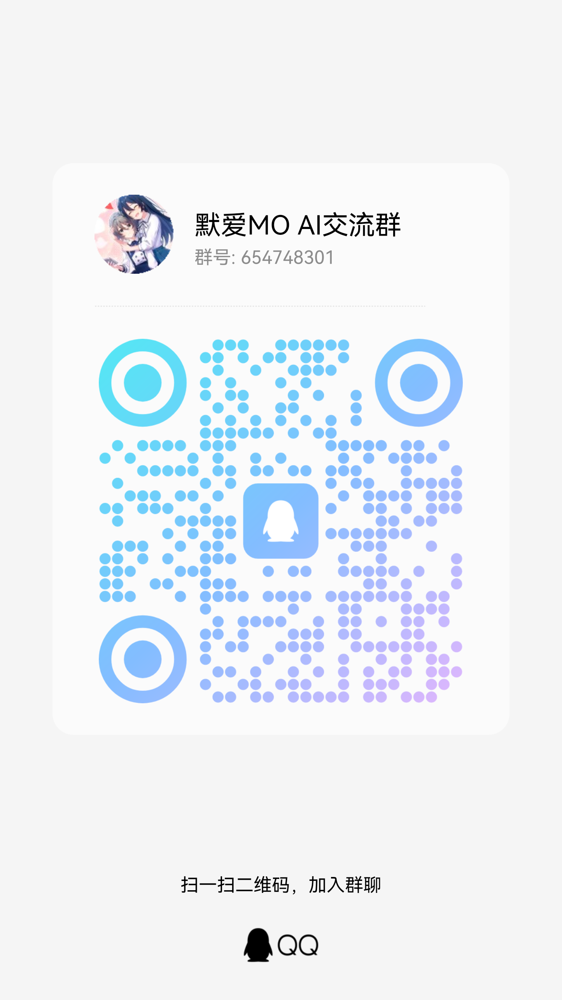

## 介绍

默爱（MO AI）Chat是基于[Langchain-Chatchat](https://github.com/chatchat-space/Langchain-Chatchat)与[BERT-VITS2](https://github.com/fishaudio/Bert-VITS2)开发的，针对《[秋之回忆](https://baike.baidu.com/item/%E7%A7%8B%E4%B9%8B%E5%9B%9E%E5%BF%86/647392)》（又名告别回忆，英文名Memories Off）粉丝群体的AI对话问答系统。仅以此项目提前庆祝秋之回忆系列25周年，并祝愿正传第9部新作《秋之回忆：双想》能够顺利发售。

目前，默爱Chat支持对《秋之回忆》基本信息的问答，知识库数据来源于秋之回忆系列作品百科和人物百科。此外，Langchain-Chatchat支持的LLM对话、文件对话等功能，默爱Chat同样支持。

本项目相较于Langchain-Chatchat 0.2.x版本，有如下**改进**：

- RAG部分，增加了BM25检索算法，以及多路召回算法；
- 支持AI语音生成，大模型返回文本答案的同时，也会生成音频。

关于Langchain-Chatchat的详细介绍，请看本项目中的[LangChain-Chatchat-README.md](LangChain-Chatchat-README.md)。

**需要注意的是：目前默爱Chat仍处于初级阶段，可能仍存在一些bug（例如目前中日/中英混杂文本的语音生成偶尔会有问题）。除了进一步完善秋之回忆的知识库信息外，未来预期会增加额外的功能，例如AI绘画、角色扮演游戏等。目前项目急缺人手，如果你对大模型/AI绘画/AI语音生成/Python开发有经验，或者对AIGC感兴趣，欢迎加入默爱项目组！联系方式见最后。**

此外，本项目需重点强调：

**严禁将此项目用于一切违反《中华人民共和国宪法》，《中华人民共和国刑法》，《中华人民共和国治安管理处罚法》和《中华人民共和国民法典》之用途。由使用本项目产生的问题和作者、原作者无关！！！**

**使用此项目的语音模型必须标注该项目出处！**

**不得使用默爱Chat提供的语音模型进行商业用途！**

## 关于配置

运行本项目至少需要：

- 一张至少4GB显存以上的**英伟达**显卡，并支持cuda11.8以上的版本；
- 16GB及以上的内存（如果你是16GB内存的Windows系统，运行该项目最好关闭其他软件以保证充足的内存空间）。

如果想部署本地大模型而非使用大模型API，那么请至少准备一张4080。目前Langchain-Chatchat以及本项目都不支持大模型INT4量化。

## 快速上手

对于不懂Python以及懒得搞环境的朋友，我提供了一份额外的[懒人版教程](懒人版教程.pdf)。该教程只需要把相应打包文件下载下来，然后按步骤运行即可，无需额外部署环境。

以下是完整环境部署步骤。

### 重要提醒

**请不要把该项目放在有中文名称的路径下，会报错！（即上级目录不得有中文字符）**

### 环境配置

> 此部分内容和Langchain-Chatchat的配置基本相同，但有些许细节需要调整。

+ 首先，确保你的机器安装了 Python 3.8 - 3.11 (我们强烈推荐使用 Python3.11）

```
$ python --version
Python 3.11.7
```

接着，创建一个虚拟环境，并在虚拟环境内安装项目的依赖。

```shell
# 依次安装全部依赖
$ pip install -r requirements_audio.txt
$ pip install -r requirements.txt 
$ pip install -r requirements_api.txt
$ pip install -r requirements_webui.txt  

# 默认依赖包括基本运行环境（FAISS向量库）。如果要使用 milvus/pg_vector 等向量库，请将 requirements.txt 中相应依赖取消注释再安装。
```

**注意，由于Streamlit的ChatBox类下的export2md函数并不支持音频格式，且未做区分，因此需要对环境里的streamlit_chatbox/messages.py进行修改，请把182行的代码修改为：**

```python
contents = [e.content for e in msg["elements"] if type(e.content) == str]
```

### 模型下载

如需在本地或离线环境下运行本项目，需要首先将项目所需的模型（注意：不是AI语音模型，是Langchain-Chatchat所需要的模型）下载至本地`pretrain_models`文件夹内，通常开源 LLM 与 Embedding模型可以从 [HuggingFace](https://huggingface.co/models) 下载。

以本项目用到的Embedding模型 [BAAI/bge-m3](https://huggingface.co/BAAI/bge-m3) 为例：下载模型需要先[安装 Git LFS](https://docs.github.com/zh/repositories/working-with-files/managing-large-files/installing-git-large-file-storage)，然后运行——

```Shell
$ git lfs install
$ git clone https://huggingface.co/BAAI/bge-m3
```

**注意，经实际对比测试，MO知识库更适合使用bge-m3作为Embedding模型，这可能是因为MO知识库涉及了大量的日语人名。**

**此外，从HuggingFace下载模型需要科学上网**，如果无法科学上网，请尝试使用镜像网站：https://hf-mirror.com/

此外，如果想使用本项目所使用的AI语音模型，请移步README后面的模型下载部分，**并请严格遵守BERT-VITS2的使用要求（见BERT-VITS2-README），严禁将语音模型用于一切违反《中华人民共和国宪法》，《中华人民共和国刑法》，《中华人民共和国治安管理处罚法》和《中华人民共和国民法典》之用途，由使用本项目产生的问题和作者、原作者无关！使用此项目的语音模型必须标注该项目出处！不得使用默爱Chat提供的语音模型进行商业用途！**

下载语音模型完成后，请将AI语音模型各自放在`audio/Data/角色名文件夹/models`中。如果你想放入自己训练的AI语音模型，请保证以下的文件结构：

```
└─audio
    └─Data
    	└─project_name
    		└─models
    		│  └─model.pth
        	├─config.json
        	├─config.yml
```

除了AI语音模型外，还需要下载在`audio/bert`文件夹下下载所需要的Bert预训练模型。本项目用到的bert模型为：

- chinese-roberta-wwm-ext-large
- deberta-v2-large-japanese-char-wwm
- deberta-v3-large

同样请在HuggingFace下载。

### 修改配置文件

配置文件统一放在`configs`文件夹内。

需要修改的主要有三个文件：

- `basic_config.py`
- `audio_config.py`
- `model_config.py`

#### basic_config.py

如果你使用的是懒人版（自带环境），**请务必将LAZY_MODE设置为True**。

#### audio_config.py

请在PROJECTS变量下，将每个语音助手（“无”除外）对应的文件路径填上。

- model_path：即`audio/Data/角色名文件夹/models`下的模型文件路径；
- config_path：即`audio/Data/角色名文件夹`下的config.json文件路径。

#### model_config.py（重要）

请在LLM_MODELS内放入你想要运行的大模型API/本地大模型名称（默认为zhipu-api）。

ONLINE_LLM_MODEL变量下是本项目支持的在线大模型API，**运行前请将申请到的API key填入，并保证网络通畅**，方能正常运行在线大模型。

关于如何申请API key以及如何修改配置文件，请参考本项目下的[API申请教程](zhipu-api申请教程.md)。

### 初始化知识库

本项目已完成了知识库的初始化步骤。如果你想自己创建额外的知识库，请参考[Langchain-Chatchat-README](LangChain-Chatchat-README.md)，以及Langchain-Chatchat的[Wiki](https://github.com/chatchat-space/Langchain-Chatchat/wiki/)。

### 启动页面

直接在命令行界面输入：

```shell
$ python startup.py -a
```

启动速度因电脑配置而有所差异，请耐心等待，并观察命令行界面是否报错。

### 注意

以上方式只是为了快速上手，如果需要更多的功能和自定义启动方式，请参考Langchain-Chatchat的[Wiki](https://github.com/chatchat-space/Langchain-Chatchat/wiki/)。

## 默爱音频模型下载

链接：https://pan.baidu.com/s/1dXfRXIce6YUmzGPG54vUUw 

提取码：MOAI 

## 加入默爱交流群

BUG反馈请提issue。

QQ群：654748301




