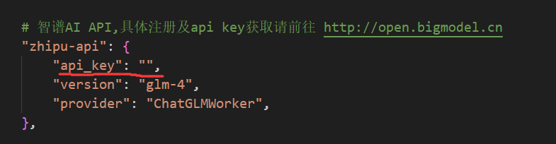

下面将以zhipu-api为例，讲解如何申请API key和修改相关配置。

大部分API key可以暂时白嫖一段时间，换着来就可以。

### 步骤一：登录注册

请登录http://open.bigmodel.cn，注册账号。

注册后可以获得一个月的白嫖token，数量足够个人用户使用了。

实名认证可以白嫖额外的token数量。

### 步骤二：查看API key

在首页点击开发工作台，点击最右上角用户图标，选择个人账户。然后点击左侧栏的API keys，即可查看自己的API key。将其复制后准备填入配置文件里。

### 步骤三：将API key填入配置文件中

打开`configs/model_config.py`，然后找到`ONLINE_LLM_MODEL`下的`zhipu-api`，将API key复制到api_key中即可完成。

